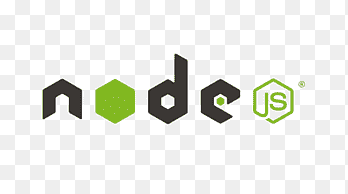
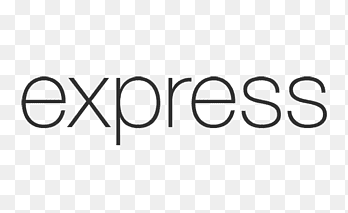

# Know More

<br>

## Table of Contents

- [Description](#description)
- [Installation](#installation)
- [Purpose](#purpose)
- [Contributing](#contributing)
- [Issues](#issues)
- [Tests](#tests)
- [Links](#links)

## Description

A social media app where users can share their thoughts, react to friends’ thoughts.

## Installation

For developers looking to develop this app further you must install [Node.js](https://nodejs.org/en/). Once you have Node.js installed, then install Node Package Manager(npm).

first...

```
npm init -y
```

then...

```
npm install express mongoose
```

## Purpose

To build an API for a social network web application where users can share their thoughts, react to friends’ thoughts, and create a friend list. Using Express.js for routing, a MongoDB database, and the Mongoose ODM. The foundation of this application is demonstrating a data flow through a node server router.

## License


<br />
This application is not currently covered by any license, but was crafted with the open source community in mind.

## Contributing

With support and assistance from the developer community at large.

## Issues

There may be slight challenges with all functionality as of initial deployment

## Testing

The testing of route creation was tested using Insomnia Core Dashboard.

## Links

[User - routes walkthrough video](https://youtu.be/wVESsP6NQUo)
</br>
[Thought - routes walkthrough video](https://youtu.be/21Xv_5vyaRI)
</br>
[Reactions - routes walkthrough video](https://youtu.be/DDTLMCqRWeA)
</br>
[Friends - routes walkthrough video](https://youtu.be/UyoKEtVVda8)

</br>




